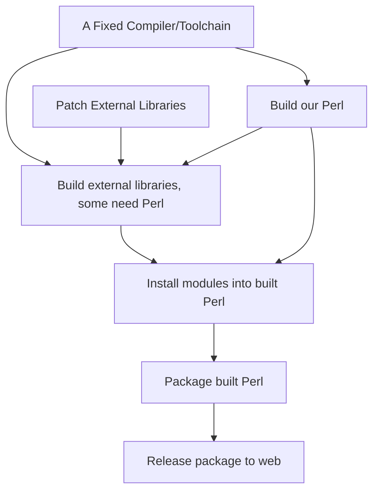

# NAME

StrawberryPerl Builder - Setup an environment for building Strawberry Perl

# SYNOPSIS

```PowerShell
cd 5.34
docker build -t strawberyperl/strawbuild:latest -t strawberyperl/strawbuild:5.34 .
docker run --rm -it strawberyperl/strawbuild:latest powershell.exe
Z:
git clone https://github.com/StrawberryPerl/build-extlibs.git
cd build-extlibs
```

At this point, you should be able to follow the instructions on the [build-extlibs](https://github.com/StrawberryPerl/build-extlibs#initial-setup) repo. All of the software you need is installed and on the path with the drive letter it
wants in place.

## Issues:

* It's hard to garner help because the build process is so complex and big.
* There isn't a working compiler/linker for Windows that we can rely
on, so we have to build our own on top of MSYS2 using MinGW.
* The compiler choice makes it nearly impossible to use DLLs built by
MSVC so we have to build our own of everything.
* We have to build some libraries never meant for Windows, so patches are needed.

The needed process looks like this:



Part of the biggest issue is getting help. The complexities listed
above scare off most people. So, we're trying to find ways to make all
of that a bit of an easier starting point for anyone wanting to
contribute. Running docker containers for Windows is a pain, but at
least if it's all there and automated for the builds, we might be able
to get some more help since they could simply update and run the
containers for whatever they think they could help with. That's what
the idea behind this repository is.

## Possible Solution:

Build all of the compiler environment and then the third-party
libraries necessary for Perl with one docker suite that stores the
results in S3 or something. Then run a second docker suite that grabs
all of that and builds Perl for us with the libraries and Perl modules
we know we're wanting. Then yet a third docker suite that packages
everything up for distribution and pushes it to the site.

## What We Need:

We'd be more than happy to have feedback and/or help with a better solution
or with this Docker idea.

# AUTHOR

Chase Whitener `<capoeirab@cpan.org>`

# COPYRIGHT & LICENSE

Copyright 2019, Chase Whitener, All Rights Reserved.

You may use, modify, and distribute this package under the
same terms as Perl itself.
