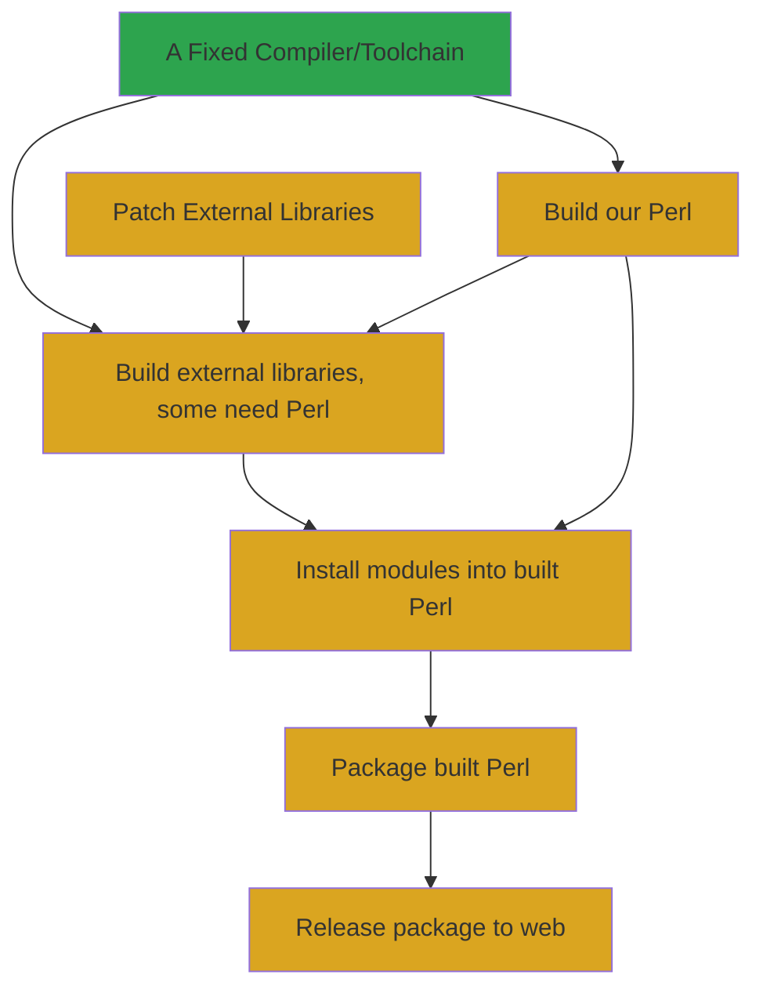

# NAME

StrawberryPerl Builder - Setup an environment for building Strawberry Perl

# SYNOPSIS

Let's build and run our container from a PowerShell.

```PowerShell
# PS C:\Users\genio>
git clone https://github.com/StrawberryPerl/spbuild.git .
cd .\spbuild\5.34
# PS C:\Users\genio\spbuild\5.34>
docker build -t strawberryperl/strawbuild:latest -t strawberryperl/strawbuild:5.34 .
docker run --rm -it strawberryperl/strawbuild:latest powershell.exe
```

Now, we're in our container we move to the Z: drive and fix a few things in MSYS2:

```PowerShell
# PS C:\spbuild>
z:
# PS Z:\>
bash -c ./gpgfix.sh
```

Next we need to install a number MSYS2 packages so that we're good to go in our build processes,
and then start a bash shell.

```PowerShell
# PS Z:\>
& .\init_msys2.ps1
git clone https://github.com/StrawberryPerl/build-extlibs.git extlib
cd extlib
# PS Z:\extlib\>
bash
```

Great! We've now got MSYS2 setup. We've got our [build-extlibs](https://github.com/StrawberryPerl/build-extlibs#building-libraries)
repo checked out and we're ready to try to build some external libraries
using the bash shell.

```bash
# ContainerAdministrator@767e415f72ad MINGW64 /z/extlib
./build.sh 5034 __
```

Now we have to wait a really, really long time. You can get a good idea of how things worked out for you by grepping through the log files:

```bash
# ContainerAdministrator@767e415f72ad MINGW64 /z/extlib
grep -E 'retval=' _5034__/*.build.log
```

TODO: Document zipping up libraries and pushing them to GitHub as a release.

TODO: Document Running a specific Perl version build using those libraries.

TODO: Document packaging Perl.

TODO: Document releasing Perl to the strawberryperl.com site.

## Issues:

* The build process is reasonably complex and involved.
* Until very recently, there wasn't a working compiler/linker for
Windows that we can rely on, so we have to build our own on top of
MSYS2 using MinGW.
* The compiler choice means DLLs built by MSVC cannot be used so we
have to build our own of everything.
* Many libraries need to be patched so they work on Windows.
Fortunately patches can often be borrowed or adapted from the
[MSYS project](https://github.com/msys2/MINGW-packages).

The needed process looks like this:



Part of the biggest issue is getting help. The complexities listed
above scare off most people. So, we're trying to find ways to make all
of that a bit of an easier starting point for anyone wanting to
contribute. Running docker containers for Windows is a pain, but at
least if it's all there and automated for the builds, we might be able
to get some more help since they could simply update and run the
containers for whatever they think they could help with. That's what
the idea behind this repository is.

## What We Need:

We need feedback and help!

We also need someone to work on the MSVC-built Strawberry setup. We
have done some very basic setup configuration in the `msvc` directory
in this repository.

# AUTHOR

Chase Whitener `<capoeirab@cpan.org>`

Shawn Laffan

# COPYRIGHT & LICENSE

Copyright 2019, strawberryperl.com, All Rights Reserved.

You may use, modify, and distribute this package under the
same terms as Perl itself.
